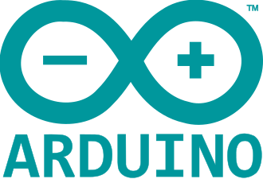

# Installation

Here is information on how to install `yzma`.

First, install the `yzma` command line tool. Then use the `yzma` command to install the `llama.cpp` libraries on your machine.

Once you have installed the `llama.cpp` libraries, you can run your Go programs that use `yzma`. See the [examples](./examples/) directory.

You can also use the `yzma` command to download models on your machine. See the [MODELS.md](./MODELS.md) page for information.

## Install `yzma` command

The first step is to install the `yzma` command line tool. You can then use it to install the `llama.cpp` libraries for your platform.

```
go install github.com/hybridgroup/yzma@latest
```

For more info, see the [`yzma` command documentation](./cmd/README.md).

## Install `llama.cpp` libraries

Now, using the `yzma` command, you can install the `llama.cpp` libraries. Follow the instructions for your system:

- [macOS](#macos)
- [Linux - CPU](#linux-cpu)
- [Linux - CUDA](#linux-cuda)
- [Linux - ROCm](#linux-rocm)
- [Linux - Vulkan](#linux-vulkan)
- [Arduino UNO Q](#arduino-uno-q)
- [NVIDIA Jetson Orin](#nvidia-jetson-orin)
- [Raspberry Pi 4/5](#raspberry-pi)
- [Windows - CPU](#windows-cpu)
- [Windows - CUDA](#windows-cuda)
- [Windows - Vulkan](#windows-vulkan)

### macOS


Decide where you want put the files for your local installation, then run the following command:

```
yzma install --lib /path/to/lib
```

To complete your installation, follow any specific instructions for your operating system displayed by the results of the `yzma install` command.

Now try running one of the example programs!

### Linux CPU


Decide where you want put the files for your local installation, then run the following command:

```
yzma install --lib /path/to/lib
```

To complete your installation, follow any specific instructions for your operating system displayed by the results of the `yzma install` command.

### Linux CUDA

If you want to use a GPU with CUDA on a Linux machine, you will need to install the CUDA drivers.

See https://docs.nvidia.com/cuda/cuda-installation-guide-linux/

Once that is complete, decide where you want put the files for your local installation, then run the following command:

```
yzma install --lib /path/to/lib --processor cuda
```

To complete your installation, follow any specific instructions for your operating system displayed by the results of the `yzma install` command.

### Linux ROCm

If you want to use an AMD GPU with ROCm on a Linux machine, you will need to install the ROCm 7.2 drivers and runtime.

#### Prerequisites

- An AMD GPU listed in AMD's [supported GPUs table](https://rocm.docs.amd.com/projects/install-on-linux/en/latest/reference/system-requirements.html) (such as AMD Instinct or supported Radeon GPUs)
- A ROCm 7.2 [supported Linux distribution](https://rocm.docs.amd.com/projects/install-on-linux/en/latest/reference/system-requirements.html) (Ubuntu 24.04 and 22.04 are the most common choices)
- A compatible AMDGPU kernel driver — see AMD's [driver installation instructions](https://instinct.docs.amd.com/projects/amdgpu-docs/en/latest/install/detailed-install/package-manager/package-manager-ubuntu.html) if your system does not already have one

#### Install ROCm 7.2

##### Ubuntu 24.04

```shell
wget https://repo.radeon.com/amdgpu-install/7.2/ubuntu/noble/amdgpu-install_7.2.70200-1_all.deb
sudo apt install ./amdgpu-install_7.2.70200-1_all.deb
sudo apt update
sudo apt install python3-setuptools python3-wheel
sudo usermod -a -G render,video $LOGNAME
sudo apt install rocm
```

##### Ubuntu 22.04

```shell
wget https://repo.radeon.com/amdgpu-install/7.2/ubuntu/jammy/amdgpu-install_7.2.70200-1_all.deb
sudo apt install ./amdgpu-install_7.2.70200-1_all.deb
sudo apt update
sudo apt install python3-setuptools python3-wheel
sudo usermod -a -G render,video $LOGNAME
sudo apt install rocm
```

Reboot your system after installing ROCm to apply all settings (the `render` and `video` group membership requires at least a log out/in to take effect).

You can verify the installation by running:

```shell
rocminfo
```

For other supported Linux distributions, see the [ROCm installation guide](https://rocm.docs.amd.com/projects/install-on-linux/en/latest/).

#### Install yzma with ROCm

Once ROCm is installed, decide where you want put the files for your local installation, then run the following command:

```
yzma install --lib /path/to/lib --processor rocm
```

Note: if ROCm is already installed, `yzma` can auto-detect it. You can simply run:

```
yzma install --lib /path/to/lib
```

To complete your installation, follow any specific instructions for your operating system displayed by the results of the `yzma install` command.

### Linux Vulkan

To use Vulkan on your Linux system, your will also need to install the Vulkan drivers. For example:

```shell
sudo apt install -y mesa-vulkan-drivers vulkan-tools
```

Once that is complete, decide where you want put the files for your local installation, then run the following command:

```
yzma install --lib /path/to/lib --processor vulkan
```

To complete your installation, follow any specific instructions for your operating system displayed by the results of the `yzma install` command.

### NVIDIA Jetson Orin


To the GPU on your [NVIDIA Jetson Orin](https://www.nvidia.com/en-us/autonomous-machines/embedded-systems/jetson-orin/nano-super-developer-kit/) you should install the latest version of the Jetpack software for your device.

#### CUDA

Decide where you want put the files for your local installation, then run the following command:

```
yzma install --lib /path/to/lib --processor cuda
```

To complete your installation, follow any specific instructions for your operating system displayed by the results of the `yzma install` command.

#### Vulkan

To use Vulkan with the GPU on your Jetson Orin, you will also need to also update the GLIBC shared libraries:

```shell
sudo add-apt-repository ppa:ubuntu-toolchain-r/test
sudo apt-get update
sudo apt-get install --only-upgrade libstdc++6
```

Once that is complete, decide where you want put the files for your local installation, then run the following command:

```
yzma install --lib /path/to/lib --processor vulkan
```

To complete your installation, follow any specific instructions for your operating system displayed by the results of the `yzma install` command.

### Raspberry Pi


You can run `yzma` on a Raspberry Pi 4 or 5.

#### Raspberry Pi OS (64-bit)

If you are running the latest version of the Raspberry Pi OS, decide where you want put the files for your local installation, then run the following command:

```
yzma install --lib /path/to/lib --processor cpu --os trixie
```

To complete your installation, follow any specific instructions for your operating system displayed by the results of the `yzma install` command.

#### Raspberry Pi OS (Legacy, 64-bit)

If you are running an older version of the Raspberry Pi OS, decide where you want put the files for your local installation, then run the following command:

```
yzma install --lib /path/to/lib --processor cpu --os bookworm
```

To complete your installation, follow any specific instructions for your operating system displayed by the results of the `yzma install` command.

### Arduino UNO Q



You can run `yzma` on a [Arduino UNO Q board](https://docs.arduino.cc/hardware/uno-q/).

```
yzma install --lib /path/to/lib --processor cpu --os trixie
```

### WebAssembly (browser)

`yzma` runs in a browser with the WebAssembly build of `llama.cpp`. All three builds come down, the one with WebGPU, the one with more threads, and the one with a single thread, and the JavaScript glue takes the one that the page can use:

```
yzma install --lib /path/to/web --os wasm
```

WebGPU needs an adapter with f16 shaders, and Chrome or Edge 137 and later, or Firefox 153 and later with `dom.webgpu.enabled` and `dom.webgpu.workers.enabled` set in `about:config`; every other browser runs on the CPU. Every build has the multimodal library, so a model with a projector works for images. This target uses the smaller API of the [`pkg/llamawasm`](./pkg/llamawasm) package. See [wasm/README.md](./wasm/README.md).

### Windows CPU


Decide where you want put the files for your local installation, then run the following command:

If you have an Nvidia card, use:
```
yzma install --lib /path/to/lib --processor cuda
```

If you have an AMD card, use:
```
yzma install --lib /path/to/lib --processor rocm
```

To complete your installation, follow any specific instructions for your operating system displayed by the results of the `yzma install` command.

### Windows CUDA

If you want to use a GPU on your Windows machine, you will need to install the CUDA drivers.

See https://docs.nvidia.com/cuda/cuda-installation-guide-microsoft-windows/

Decide where you want put the files for your local installation, then run the following command:

```
yzma install --lib /path/to/lib --processor cuda
```

To complete your installation, follow any specific instructions for your operating system displayed by the results of the `yzma install` command.

### Windows Vulkan

To use Vulkan, you will need to install the Vulkan SDK.

https://vulkan.lunarg.com/doc/sdk/latest/windows/getting_started.html

Decide where you want put the files for your local installation, then run the following command:

```
yzma install --lib /path/to/lib --processor vulkan
```

To complete your installation, follow any specific instructions for your operating system displayed by the results of the `yzma install` command.

## Next steps

Now the installation is complete. Try running one of the example programs!

## Manual installation

If you prefer a manual installation, you can obtain most of the prebuilt `llama.cpp` binaries from here:

https://github.com/ggml-org/llama.cpp/releases

We also have binaries available for Ubuntu CUDA and Vulkan for arm64 located here:

https://github.com/hybridgroup/llama-cpp-builder/releases

### Installing the prebuilt binaries (manual)

If you do not use the `yzma` installer, you must download and extract the library files into a directory on your local machine.

#### Linux

For Linux, they have the `.so` file extension. For example, `libllama.so`, `libmtmd.so` and so on.

***Important Note***
You currently need to set the `YZMA_LIB` env variable to the directory with your llama.cpp library files. For example:

```shell
export YZMA_LIB=/home/ron/Development/yzma/lib
```

#### macOS

For macOS, the `llama.cpp` binaries have a `.dylib` file extension. For example, `libllama.dylib`, `libmtmd.dylib` and so on. You do not need the other downloaded files to use the `llama.cpp` libraries with `yzma`.

***Important Note***
You currently need to set the `YZMA_LIB` env variable to the directory with your `llama.cpp` library files. For example:

```shell
export YZMA_LIB=/home/ron/Development/yzma/lib
```

#### Windows

On Windows, the `llama.cpp` binaries have the `.dll` file extension. For example, `llama.dll`, `mtmd.dll` and so on.

You will also need to download the `cudart` files from the same location as the other `llama.cpp` libraries when using CUDA on Windows.

***Important Note***
You currently need to set the `YZMA_LIB` env variable to the directory with your `llama.cpp` library files. For example:

```shell
set YZMA_LIB=C:\yzma\lib
```
## Programmatic Installation

Want to use Go code to install the `llama.cpp` precompiled binaries from within your own application? We have the `download` package for that!

Check out the [installer example code](./examples/installer/).

### Choosing which build to install

`download.Install` takes a `Target` and an optional `Resolver`. Passing `nil` uses the
built-in table, which is what `Get` does:

```go
target := download.Target{
	Arch:      download.MustParseArch(runtime.GOARCH),
	OS:        download.MustParseOS(runtime.GOOS),
	Processor: download.CUDA,
	Version:   "latest",
}

err := download.Install(context.Background(), target, libPath, download.ProgressTracker, nil)
```

A `Resolver` reports the assets to install for a target, as URLs downloaded in the order
returned. Implement one to install a build the table doesn't name — from an internal
mirror or artifact server, from a `file://` path on an air-gapped machine, from your own
llama.cpp build, or a different CUDA major version than the default:

```go
resolver := download.ResolverFunc(func(t download.Target) ([]string, error) {
	if t.OS == download.Linux && t.Arch == download.AMD64 && t.Processor == download.CUDA {
		return []string{"https://mirror.example.com/llama/" + t.Version + "-cuda12-x64.tar.gz"}, nil
	}
	// Anything you don't care about falls through to the built-in table.
	return download.DefaultResolver.Resolve(t)
})

err := download.Install(context.Background(), target, libPath, download.ProgressTracker, resolver)
```

Notes:

- Return several URLs when a build needs more than one archive; they install in order, so
  put a dependency (such as a CUDA runtime archive) before the libraries that need it.
- Resolvers must not download anything themselves — return URLs and let `Install` fetch
  them, so `.tar.gz` and `.zip` archives are unpacked the same way as the built-in builds.
- `Version` may be `""` or `"latest"`; `Install` resolves it to a release tag before
  calling the resolver, so `t.Version` is always concrete. `""` takes
  `download.DefaultVersion`, the llama.cpp release this yzma release was tested with.
  A development build of yzma leaves that empty, so `""` then gets the most recent
  nightly build. `"latest"` always gets the most recent nightly build.
- A tagged release such as `v0.3.0` has no binaries on the llama.cpp release page, so
  `Install` also sets `t.UpstreamVersion` to the nightly build tag that holds them.
- Anything [go-getter](https://github.com/hashicorp/go-getter) supports works as a URL,
  including `file://` and S3/GCS.

See the [resolver example code](./examples/resolver/).

### Checking what comes down

`Install` checks the SHA-256 of each asset before it writes anything. The expected
digests come from the manifest that `llama-cpp-builder` publishes for each release tag,
next to the version files:

```
https://hybridgroup.github.io/llama-cpp-builder/digests/b10783.json
```

An asset whose bytes do not agree stops the install with `download.ErrDigestMismatch`,
and nothing is extracted.

The default is `VerifyIfAvailable`. An asset that has no digest still installs, and
`download.VerifyWarning` prints a line about it. Set that to `nil` to say nothing.

A deployment that must know which libraries it loads asks for more:

```go
err := download.Install(context.Background(), target, libPath, download.ProgressTracker, nil,
	download.WithVerify(download.VerifyRequired))
```

`VerifyRequired` makes an asset with no digest an error, `download.ErrDigestMissing`.
`VerifyOff` checks nothing.

The `yzma install` command takes the same setting from the `YZMA_VERIFY` environment
variable, which accepts `available` (the default), `require`, and `off`.

#### Digests from your own resolver

A `Resolver` returns URLs only, so it reports no digests and `VerifyRequired` refuses it.
Implement `AssetResolver` as well to give a digest for each asset:

```go
type mirrorResolver struct{}

func (mirrorResolver) Resolve(t download.Target) ([]string, error) {
	return download.DefaultResolver.Resolve(t)
}

func (r mirrorResolver) ResolveAssets(t download.Target) ([]download.Asset, error) {
	return []download.Asset{{
		URL:    "https://mirror.example.com/llama/" + t.Version + "-cuda12-x64.tar.gz",
		SHA256: mirrorDigest(t.Version),
	}}, nil
}
```

`Install` prefers `ResolveAssets` when a resolver has both. A resolver that wraps
`DefaultResolver` should implement `AssetResolver` and delegate to
`download.DefaultResolver.(download.AssetResolver).ResolveAssets(t)`, or the assets it
passes through lose their digests.

The digests show that an archive is the archive that was published. They are not a
signature, and a digest that comes from the same place as the asset does not show who
built it.

#### Pinning the digests

Every digest above comes from the same site that serves the asset. Anyone who can
replace an asset can also replace the manifest that gives its digest. So the check
finds a damaged download, but it does not find one that was put there on purpose.

Keep the expected value where the release host cannot change it. Pin the digest of the
manifest in the release that uses yzma. A version takes the digest as a suffix:

```
b10785
b10785@sha256:<64 hexadecimal characters>
```

```go
target := download.Target{
	Arch: download.AMD64, OS: download.Linux, Processor: download.CUDA,
	Version: "b10785@sha256:" + wantManifest,
}
err := download.Install(context.Background(), target, libPath, download.ProgressTracker, nil)
```

`Target.ManifestSHA256` holds the same value for a caller that does not want to build
the string. `Get`, `GetWithProgress` and `GetWithContext` take the suffix form in their
version argument, and so does the command line:

```
yzma install --version b10785@sha256:<digest> --lib /path/to/lib
yzma verify --version b10785@sha256:<digest> --lib /path/to/lib
```

Only the tag is used for URLs, for the resolver, for the install record, and for the
version that yzma reports. The pin is not part of any of them.

What gets pinned is the manifest and not one archive. A version selects a different set
of assets for each target, and some targets need more than one, so no single archive
digest covers them all. The chain goes from the pin, to the manifest bytes, to the
digest of every asset that the manifest names.

A pin makes verification mandatory:

- The manifest bytes are checked before they are decoded.
- A manifest that cannot be read is an error, and not an install with no check. A
  manifest that gives 404 can no longer turn the check off.
- An asset that the manifest does not name stops the install with `ErrDigestMissing`.
  So a pin also works with a plain `Resolver`, because `Install` reads the manifest
  itself. A resolver that names assets the release does not publish, such as a mirror
  with its own URLs, cannot be used with a pin.
- A pin that comes with `VerifyOff` gives `download.ErrVerifyDisabled`.

`latest` and an empty version name whichever release is newest at the time, so neither
can carry a digest. An invalid tag, an algorithm that is not `sha256`, or a value that
is not 64 hexadecimal characters gives `download.ErrInvalidDigest` or
`download.ErrInvalidVersion` before anything comes down.

A pin says that the manifest is the one you expected. It still is not a signature. It
does not say who built the assets. Build provenance would.

### Checking an installation later

The archive is removed as soon as it is extracted, so a later check reads the files that
are in place. `Install` writes `yzma-install.json` beside the libraries to say what it
put there, and `VerifyInstall` checks them:

```go
report, err := download.VerifyInstall(context.Background(), libPath, "")
if err != nil {
	return err
}
if !report.OK() {
	return fmt.Errorf("%d changed, %d missing", report.Changed, report.Missing)
}
```

An empty tag takes the release from the record. Give a tag to name the release that must
be there. The record is beside the libraries, so anything that can change the libraries
can change the record. A tag makes the check resolve the assets of that release itself
instead of reading the tag from the record.

A file that no asset of this install holds is reported as `FileUnexpected` and does not
make `OK` false, because a directory can hold more than one install.

The file digests come from the asset, so they are there only for the assets that
`llama-cpp-builder` builds. An install from the `llama.cpp` release page gives
`ErrNoFileDigests`.

The `yzma verify` command does the same thing from a shell. See
[the command documentation](./cmd/README.md).
